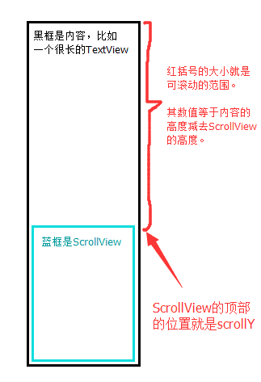
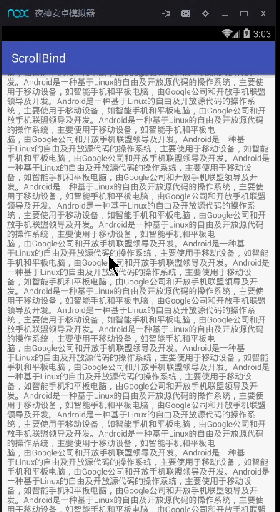

说到滚动控件广大开发者朋友们首先想到的无非就是 ListView 和 ScrollView 两大控件，对于前者而言添加滑块无非是 XML 里面一句话的事情，但是对于后者来说就没那么容易了，至少笔者至今并没有找到简单的解决方案。

也罢，没有轮子的话就自己造一个。思路的话比较简单粗暴：使用 SeekBar 作为滑块绑定到 ScrollView 上。

# 垂直的 SeekBar

要给 ScrollView 添加滑块的话 SeekBar 必须是垂直的，这里笔者使用的是 GitHub 上的 [android-verticalseekbar](https://github.com/h6ah4i/android-verticalseekbar)。

当然，如果你想要给 HorizontalScrollView 添加滑块的话原生的SeekBar就够了。

# ScrollView 的监听和滚动范围

大部分的控件都提供监听者模式的回调，然而不知道为什么 ScrollView 本身没有暴露监听滚动的方法。写个子类开发接口也是可以的，不过笔者这里是直接使用了 Google 官方提供的 NestScrollView。

我们先分析一下其回调接口：

```java 
public interface OnScrollChangeListener {
        void onScrollChange(NestedScrollView v, int scrollX, int scrollY,int oldScrollX, int oldScrollY);
}
```

其中 scrollY 是当前的滚动位置，和可滚动范围的关系图解如下：



理解了这一层关系之后要做的就很简单了，我们将可滚动范围和 scrollY 映射到 SeekBar 上即可。

# 滚动绑定

明白了逻辑之后我们只需要将 ScrollView 的滚动映射到 SeekBar，再将 SeekBar 的用户拖动映射回 ScrollView 就行了。以下是笔者封装了的一个辅助类，注释比较详尽：

```java
public class ScrollBindHelper implements SeekBar.OnSeekBarChangeListener, NestedScrollView.OnScrollChangeListener {

	private final SeekBar seekBar;
	private final NestedScrollView scrollView;
	private final View scrollContent;

	// 使用静态方法绑定并返回对象
	public static ScrollBindHelper bind (SeekBar seekBar, NestedScrollView scrollView) {
		ScrollBindHelper helper = new ScrollBindHelper(seekBar, scrollView);
		seekBar.setOnSeekBarChangeListener(helper);
		scrollView.setOnScrollChangeListener(helper);
		return helper;
	}

	private ScrollBindHelper (SeekBar seekBar, NestedScrollView scrollView) {
		this.seekBar = seekBar;
		this.scrollView = scrollView;
		this.scrollContent = scrollView.getChildAt(0);
	}

	// 用户是否正在拖动 SeekBar 的标志
	private boolean isUserSeeking;

	// 获取滚动范围
	private int getScrollRange () {
		return scrollContent.getHeight() - scrollView.getHeight();
	}

	@Override
	public void onScrollChange (NestedScrollView v, int scrollX, int scrollY, int oldScrollX, int oldScrollY) {
		// 用户拖动 SeekBar 时不触发 ScrollView 的回调
		if (isUserSeeking) {return;}

		// 计算当前滑动位置相对于整个范围的百分比，并映射到 SeekBar 上
		int range = getScrollRange();
		seekBar.setProgress(range != 0 ? scrollY * 100 / range : 0);
	}

	@Override
	public void onProgressChanged (SeekBar seekBar, int progress, boolean fromUser) {
		// 当不是用户操作，也就是 ScrollView 的滚动隐射过来时不执行操作
		if (!fromUser) { return;}

		// 将拖动的百分比换算成 Y 值，并映射到 SrollView 上
		scrollView.scrollTo(0, progress * getScrollRange() / 100);
	}

	@Override
	public void onStartTrackingTouch (SeekBar seekBar) {
		// 标记用户正在拖动 SeekBar
		isUserSeeking = true;
	}

	@Override
	public void onStopTrackingTouch (SeekBar seekBar) {
		// 标记用户已经不再操作 SeekBar
		isUserSeeking = false;
	}
}

```

# 可见性和动画

我们知道滚动视图的滑块并不是一直存在的，它有着如下的行为：

- 默认不可见
- 内容视图高度太小，比如小于三个屏幕高度时不出现滑块
- 出现之后界面滚动或者滑块被用户触控时滑块不会消失
- 停止操作若干毫秒后消失

可见性的切换我们只要切换滑块控件的 Visible 属性即可而滚动和触控都在我们的回调之中，最后停止操作若干秒后消失可以直接使用一个 handler 搞定。我们创建一个只响应最后一次操作的 Handler 基类。

```java
//只响应最后一次操作的基类
public abstract class LastMsgHandler extends Handler {

	// 标记是第几次 count
    private int count = 0;

    /**
     * 增加 Count 数。
     */
    public synchronized final void increaseCount() {
        count++;
    }

	// 直接发送消息
    public final void sendMsg() {
        sendMsgDelayed(0);
    }

	// 增加 count 数后发送延时消息
	// 如果延时小于或者等于 0 则直接发送。
    public final void sendMsgDelayed(long delay) {
        increaseCount();
        if (delay <= 0) {
            sendEmptyMessage(0);
        } else {
            sendEmptyMessageDelayed(0, delay);
        }
    }

	// 清空所有 count 和消息
    public synchronized final void clearAll() {
        count = 0;
        removeCallbacksAndMessages(null);
    }

    @Override
    public synchronized final void handleMessage(Message msg) {
        super.handleMessage(msg);
        count--;
        
        // 确保 count 数不会异常
        if (count < 0) {
            throw new IllegalStateException("count数异常");
        }
		
		// 当 count 为 0 时说明是最后一次请求
        if (count == 0) {
            handleLastMessage(msg);
        }
    }

	// 响应最后一次请求
    protected abstract void handleLastMessage(Message msg);
}

```

之后我们继承该类实现最后一次响应请求时切换滑块可见性的方法：

```java
private static class VisibleHandler extends LastMsgHandler {

    public static final long DEFAULT_TIME_OUT = 1000L;		

    private ScrollBindHelper helper;

    public VisibleHandler(ScrollBindHelper helper) {
        this.helper = helper;
    }

    public void reset() {
        sendMsgDelayed(DEFAULT_TIME_OUT);
    }

    @Override
    protected void handleLastMessage(Message msg) {
        helper.hideScroll();
    }
}
```

之后只需要将计时器安插进原有的回调即可。最后给出完整版的 ScrollHelper。

```java
public class ScrollBindHelper implements SeekBar.OnSeekBarChangeListener, NestedScrollView.OnScrollChangeListener {

    private final SeekBar seekBar;
    private final NestedScrollView scrollView;
    private final View scrollContent;

    /**
     * 使用静态方法来绑定逻辑，代码可读性更高。
     */
    public static ScrollBindHelper bind(SeekBar seekBar, NestedScrollView scrollView) {
        ScrollBindHelper helper = new ScrollBindHelper(seekBar, scrollView);
        seekBar.setOnSeekBarChangeListener(helper);
        scrollView.setOnScrollChangeListener(helper);
        return helper;
    }

    private ScrollBindHelper(SeekBar seekBar, NestedScrollView scrollView) {
        this.seekBar = seekBar;
        this.scrollView = scrollView;
        this.scrollContent = scrollView.getChildAt(0);
    }

    private boolean isUserSeeking;

    private int getContentRange() {
        return scrollContent.getHeight();
    }

    private int getScrollRange() {
        return scrollContent.getHeight() - scrollView.getHeight();
    }

    @Override
    public void onScrollChange(NestedScrollView v, int scrollX, int scrollY, int oldScrollX, int oldScrollY) {
        //用户触控时不触发
        if (isUserSeeking) {
            return;
        } else if (getContentRange() < ViewUtil.getScreenHeightPx() * 3) {//宽度小于三个屏幕不做处理
            return;
        }

        int range = getScrollRange();
        seekBar.setProgress(range != 0 ? scrollY * 100 / range : 0);
    }

    @Override
    public void onProgressChanged(SeekBar seekBar, int progress, boolean fromUser) {
        showScroll();

        if (!isUserSeeking) {
            handler.reset();
        }

        //不是用户操作的时候不触发
        if (!fromUser) {
            return;
        }

        scrollView.scrollTo(0, progress * getScrollRange() / 100);
    }

    @Override
    public void onStartTrackingTouch(SeekBar seekBar) {
        isUserSeeking = true;
        handler.clearAll();
    }

    @Override
    public void onStopTrackingTouch(SeekBar seekBar) {
        isUserSeeking = false;
        handler.reset();
    }

	/*动画*/

    public static final long DEFAULT_TIME_OUT = 1000L;

    private static class VisibleHandler extends WeakRefLastMsgHandler<ScrollBindHelper> {

        public VisibleHandler(ScrollBindHelper ref) {
            super(ref);
        }

        public void reset() {
            sendMsgDelayed(DEFAULT_TIME_OUT);
        }

        @Override
        protected void onLastMessageLively(@NonNull ScrollBindHelper ref, Message msg) {
            ref.hideScroll();
        }
    }

    private VisibleHandler handler = new VisibleHandler(this);

    private void hideScroll() {
        ViewUtil.hideWithAnim(seekBar, 0);
    }

    private void showScroll() {
        ViewUtil.showWithAnim(seekBar, 0);
    }

}
```

最终效果图如下：



以下是源码地址，部分代码和博客中的可能有所出入：

<http://download.csdn.net/detail/drkcore/9505456>