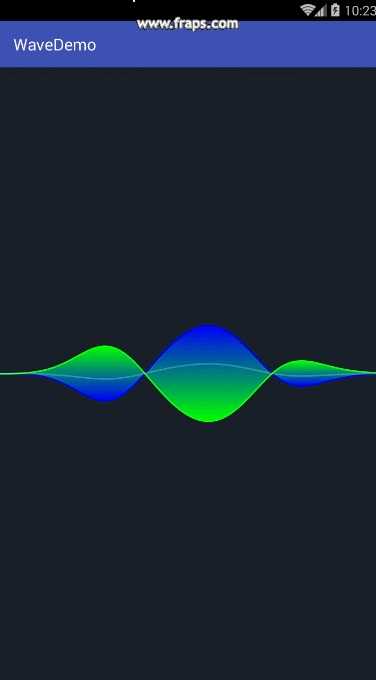
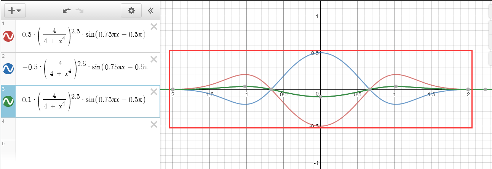
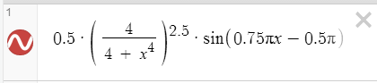
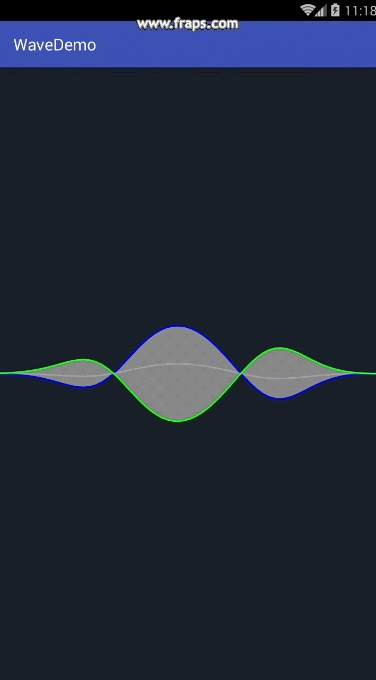
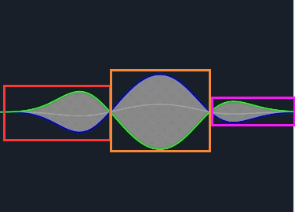
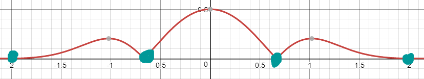
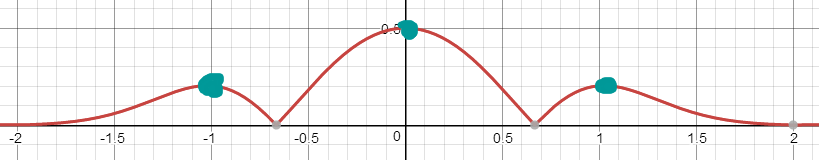
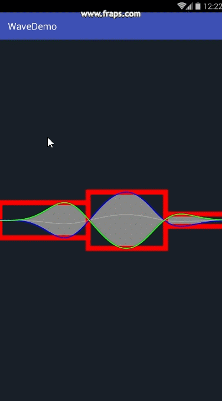
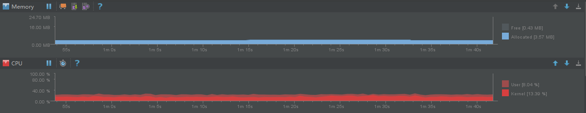

近日看到了Bugly发布的一篇关于自绘动画的博客《[Android自绘动画实现与优化实战——以Tencent OS录音机波形动画为实例](http://mp.weixin.qq.com/s?__biz=MzA3NTYzODYzMg==&mid=2653577211&idx=1&sn=2619c7df79f675e45e87891b7eb17669&scene=4#wechat_redirect)》，写的非常有深度但可惜没有放出源码，惊叹之余便有了亲自造个轮子的想法。

~~这是Bugly博客中给出的效果图，可以看到是非常的酷炫：~~
图片无法引用，如果想要查看效果的话可以到bugly公众号去查看原贴。

废话不多说，先放出效果图给大家看一下：



可以看到除了四处飞舞的小球和颜色不太对以外，大致的效果还是差不多的。

接下来让我们看看如何实现这些效果的。

当然，如果你想直接看代码可以直接看末尾。

# 一、 图形函数

按照Bugly的博文中给出的公式我们首先在[Desmos图形计算器](https://www.desmos.com/calculator)上计算出需要绘制的图形，如下：



我们可以看到一共有三条波形，红色和蓝色波是录音波形的上下轮廓，绿色的波形则在中间，其振幅是上下两条波形的五分之一。

虽然有三条波形但其实我们只需要一个函数，其他两条都可以通过对该函数进行简单的数学换算得到：



用JAVA来表达也就是：

```java
/**
* 计算波形函数中x对应的y值
*
* @param mapX   x值
* @param offset 偏移量
* @return
*/
private double calcValue(float mapX, float offset) {
    //这里的offset * Math.PI是偏移量φ
    double sinFunc = Math.sin(0.75 * Math.PI * mapX - offset * Math.PI);
    double recessionFunc = Math.pow(4 / (4 + Math.pow(mapX, 4)), 2.5);
    return 0.5 * sinFunc * recessionFunc;
}
```

正弦函数的公式是 **y=Asin（ωx+φ）+k**，其中 **φ** 是偏移量，代码中通过 ```offset * Math.PI``` 来实现。这样我们只要在绘图的过程中将时间的流逝换算成偏移量即可实现波形的变换，配合 ```Thread.sleep``` 就可以捣腾出动画的效果。

图片中使用红色框图圈出的范围是我们关注的波形所在，取值如下：

```
x = [-2,2]
y = [-0.5,0.5]
```

显然所有的手机屏幕的尺寸都比这个范围大，因而我们需要将屏幕上的坐标点一一映射到这个区域之中，同时按照Bugly博客原文给出的思路我们只需要采样部分的点即可，映射的代码如下：

```java
//采样点的数量，越高越精细，
//但高于一定限度后人眼察觉不出。
static final int SAMPLING_SIZE = 64;
//采样点的X
float[] samplingX;
//采样点位置均匀映射到[-2,2]的X
float[] mapX;

if (samplingX == null) {//首次初始化
    //获取基本参数
    width = canvas.getWidth();

    //初始化采样点和映射
    samplingX = new float[SAMPLING_SIZE + 1];//因为包括起点和终点所以需要+1个位置
    mapX = new float[SAMPLING_SIZE + 1];//同上
    float gap = width / (float) SAMPLING_SIZE;//确定采样点之间的间距
    float x;
    for (int i = 0; i <= SAMPLING_SIZE; i++) {
        x = i * gap;
        samplingX[i] = x;
        mapX[i] = (x / (float) width) * 4 - 2;//将x映射到[-2,2]的区间上
    }
}
```

笔者在模拟器中使用采样的点数为64个，图形的边缘仍然十分圆滑，如果觉得偏低或者偏高可以修改 SAMPLING_SIZE 的大小。

我们有了波形函数有了映射关系便可以很容易地得到波形上的每一采样点，之后使用路径 Path 连接采样点即可。按照 16ms 的间隔休眠绘图线程之后我们便得到这样效果：



到这里我们离成功就只差一半了。

# 二、 渐变效果

我们可以看到 Bugly 给出的效果图中的波内有渐变效果，并且给出思路是使用 ```PorterDuffXfermode``` 来实现，可是原文中并没有给出绘制渐变的矩形的位置计算方式。也好，自己动手挺有意思的。

首先我们需要确定矩形的范围，如下图：



很明显我们可以知道，我们需要的点有：

## 1、 弦线与x轴的交点

由于我们采样率并不会很高，所以我们可能无法找到 y = 0 的那个采样点，取而代之的，我们可以使用正弦函数取绝对值的最小极值点，如图：



只要一个点的值小于旁边两点的值就符合这个条件。同时起止点很明显与 x 轴相交，也要算上。

## 2、 波峰点

很明显，我们需要取正弦行数绝对值的最大极值点，如图：



波峰点和交叉点是交替进行的，同时为了避免平缓处因为精度问题引起的 BUG，需要使用一个标志交替进行选择： 

```java
//波形函数的值，包括上一点，当前点和下一点
float lastV, curV = 0, nextV = (float) (amplitude * calcValue(mapX[0], offset));
//波形函数的绝对值，用于筛选波峰和交错点
float absLastV, absCurV, absNextV;
//上一个筛选出的点是波峰还是交错点
boolean lastIsCrest = false;
//筛选出的波峰和交叉点的数量，包括起点和终点
int crestAndCrossCount = 0;

//遍历所有采样点
for (int i = 0; i <= SAMPLING_SIZE; i++) {
    //计算采样点的位置
    x = samplingX[i];
    lastV = curV;
    curV = nextV;
    //提前算出下一采样点的值
    nextV = i < SAMPLING_SIZE ? (float) (amplitude * calcValue(mapX[i + 1], offset)) : 0;

    //连接路径
    firstPath.lineTo(x, centerHeight + curV);
    secondPath.lineTo(x, centerHeight - curV);
    //中间那条路径的振幅是上下的1/5
    centerPath.lineTo(x, centerHeight + curV / 5F);

    //记录极值点
    absLastV = Math.abs(lastV);
    absCurV = Math.abs(curV);
    absNextV = Math.abs(nextV);
    if (i == 0 || i == SAMPLING_SIZE/*起点终点*/ || (lastIsCrest && absCurV < absLastV && absCurV < absNextV)/*上一个点为波峰，且该点是极小值点*/) {
        xy = crestAndCrossPints[crestAndCrossCount++];
        xy[0] = x;
        xy[1] = 0;//交错点的y值取0
        lastIsCrest = false;
    } else if (!lastIsCrest && absCurV > absLastV && absCurV > absNextV) {/*上一点是交叉点，且该点极大值*/
        xy = crestAndCrossPints[crestAndCrossCount++];
        xy[0] = x;
        xy[1] = curV;//取真实值
        lastIsCrest = true;
    }
}
```

绘制的时候每隔2个点绘制一个矩形，如图：

```java
//绘制渐变
paint.setColor(Color.BLUE);
paint.setStyle(Paint.Style.FILL);
paint.setXfermode(xfermode);
float startX, crestY, endX;
for (int i = 2; i < crestAndCrossCount; i += 2) {
    //每隔两个点可绘制一个矩形。这里先计算矩形的参数
    startX = crestAndCrossPints[i - 2][0];
    crestY = crestAndCrossPints[i - 1][1];
    endX = crestAndCrossPints[i][0];

    rectF.set(startX, centerHeight + crestY, endX, centerHeight - crestY);
    canvas.drawRect(rectF, paint);
}
```

之后我们就可以得到如下的效果：



之后使用渐变和 ```SRC_IN``` 的混合模式就可以得到开头给出的效果图，这里就不再赘述。

# 三、 关于飞舞的小点

我们可以看到 Bugly 博客中除了波形之外还有几颗飞舞的小点，绘制点十分的简单，但是小球飞舞的路径函数博文并没有给出。

目测一下应该也是按照流逝的时间通过正弦函数的换算出 x、y 的值的。这里先留个坑，以后有空的话再填吧。

# 结语

将以上实现的 Demo 跑起来之后我们就可以在 AS 的 Android monitor 中看到程序运行的内存占用和CPU使用率的情况了，如下：



可以看到内存的分配和 GC 还是十分平缓的，稳定在 4MB 以内，但是 CPU 似乎有些爆炸，平均在 25% 左右。Bugly 的博文中倒是没有给出 CPU 的使用情况，不过想必肯定会比笔者实现的这个好不少。

总之通过实现这个 Demo 真能学到不少东西，在这里给 Bugly 博文的作者点个赞吧！

最后放出GitHub地址：
[https://github.com/DrkCore/CoreDemo](https://github.com/DrkCore/CoreDemo)

如果你觉得“哎哟，不错哦”请给我Star一下，或者想自己魔改的话就 fork 一下呗。